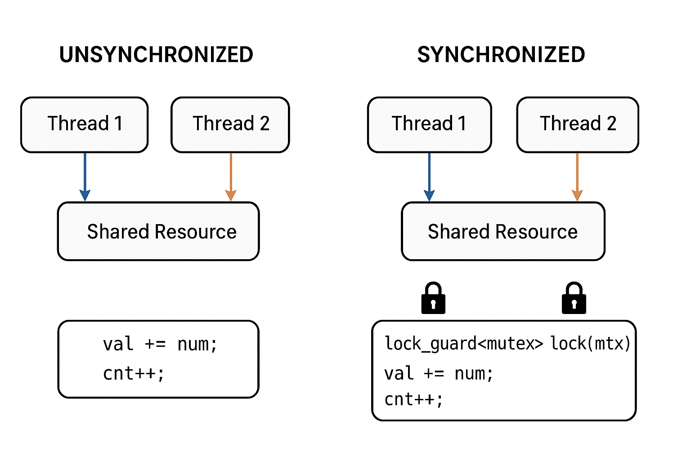

# C++ Multithreading Comprehensive Guide

## 1. Introduction

Multithreading allows a program to perform multiple operations concurrently. It is essential for achieving high performance, responsive applications, and parallel computation.

## 2. Basic Thread Creation

C++ provides the `<thread>` library for creating threads.

```cpp
#include <thread>
#include <iostream>
using namespace std;

void func(string name) {
    cout << "Hello from thread! " << name << endl;
}

int main() {
    thread t(func, "James");
    t.join();
    cout << "Main thread finished!" << endl;
    return 0;
}
```

### 2.1 Types of Thread Callables

1. **Functions**
2. **Lambda Expressions**
3. **Function Objects (Functors)**
4. **Static and Non-Static Member Functions**

Example:

```cpp
class MyClass {
public:
    void printNonStatic() { cout << "Non-static function" << endl; }
    void printValues(float f) { cout << "f = " << f << endl; }
    static void printStatic() { cout << "Static function" << endl; }
    static void printStaticValue(int num) { cout << "Static func with num = " << num << endl; }
};
MyClass obj;
thread t1(&MyClass::printNonStatic, &obj);
thread t2(&MyClass::printValues, &obj, 5.6);
thread t3(&MyClass::printStatic);
thread t4(&MyClass::printStaticValue, 26);
t1.join(); t2.join(); t3.join(); t4.join();
```

## 3. Problems with Multithreading

* **Race Conditions:** Multiple threads access shared resources simultaneously leading to inconsistent or incorrect results.
* **Deadlocks:** Two or more threads are waiting on each other indefinitely.
* **Resource Starvation:** Threads waiting too long due to other threads holding resources.
* **Non-Deterministic Behavior:** Thread execution order is unpredictable.

### 3.1 Example of Race Condition

```cpp
double val = 0;
int cnt = 0;

void add(double num) {
    val += num;
    cnt++;
    cout << "Thread " << cnt << "<: " << val << endl;
}

thread t1(add, 4);
thread t2(add, 6);
t1.join(); t2.join();
cout << "After addition: " << val << endl;
```

* Output may vary due to concurrent access.



## 4. Thread Synchronization

Synchronization ensures correct access to shared resources.

### 4.1 Synchronization Primitives

1. **Mutex (`std::mutex`)**

* **Purpose:** Protect shared resources from concurrent access.
* **How it works:** Only one thread can lock the mutex at a time; others are blocked until it’s unlocked.
* **Use case:** When multiple threads read/write a shared variable.
* **Example:**

```cpp
std::mutex mtx;
int counter = 0;

void increment() {
    mtx.lock();
    counter++;
    mtx.unlock();
}
```

**Tip:** Prefer `std::lock_guard` or `std::unique_lock` instead of manually calling `lock()`/`unlock()`.

2. **Locks (`std::lock_guard`, `std::unique_lock`)**

* **Purpose:** RAII wrappers for mutexes — automatically handle locking and unlocking.
* **Differences:**

    * `lock_guard` → simple, locks on creation, unlocks on scope exit.
    * `unique_lock` → more flexible, can lock/unlock manually, used with `condition_variable`.
* **Example:**

```cpp
std::mutex mtx;
void increment() {
    std::lock_guard<std::mutex> lock(mtx); // automatic unlock
    counter++;
}
```

3. **Condition Variable (`std::condition_variable`)**

* **Purpose:** Make threads wait until a certain condition is true. Often used with a mutex.
* **How it works:**

    * Threads sleep on `wait()`.
    * Another thread calls `notify_one()` or `notify_all()` to wake them.
* **Use case:** Producer-consumer patterns, signaling events, waiting for data readiness.
* **Example:**

```cpp
std::mutex mtx;
std::condition_variable cv;
bool ready = false;

void worker() {
    std::unique_lock<std::mutex> lock(mtx);
    cv.wait(lock, []{ return ready; }); // wait until ready == true
    // do work
}

void main_thread() {
    {
        std::lock_guard<std::mutex> lock(mtx);
        ready = true;
    }
    cv.notify_all(); // wake all waiting threads
}
```

### Quick Summary Table

| Primitive                 | Purpose                    | Use Case                                      |
| ------------------------- | -------------------------- | --------------------------------------------- |
| `std::mutex`              | Lock a resource            | Protect shared data                           |
| `std::lock_guard`         | RAII lock for mutex        | Auto lock/unlock in a scope                   |
| `std::unique_lock`        | Flexible RAII lock         | Used with condition variables, manual control |
| `std::condition_variable` | Wait for a condition/event | Producer-consumer, signaling between threads  |

✅ **Key Point:**

* Mutexes/locks → prevent simultaneous access (safety).
* Condition variables → let threads wait and notify (coordination).

### 4.2 Example: Comparing Unsynchronized, Mutex, and Condition Variable

```cpp
// Unsynchronized shared resource
thread ws1(add, 4);
thread ws2(add, 6);
ws1.join(); ws2.join();
cout << "After addition: " << val << endl;

// Mutex-protected shared resource
double val2 = 0;
int cnt2 = 0;
std::mutex mtx;
void add2(double num) {
    std::lock_guard<std::mutex> lock(mtx);
    val2 += num;
    cnt2++;
    cout << "Thread with mutex: " << cnt2 << "<: " << val2 << endl;
}
thread wmtx3(add2, 4);
thread wmtx2(add2, 6);
wmtx3.join(); wmtx2.join();
cout << "After addition: " << val2 << endl;

// Condition variable example would include threads waiting until main signals readiness
```

* Without mutex, results may vary due to race conditions.
* With mutex, updates are consistent.
* Condition variables allow coordinated waiting between threads.

## 5. Use Cases in Banking

* **Transaction processing:** Parallel updates with mutexes.
* **Batch processing:** Wait for data readiness with condition variables.
* **Real-time analytics:** Run calculations concurrently for multiple accounts.
* **Fraud detection engines:** Threads handle multiple streams and coordinate with condition variables.

## 6. Best Practices

* Use **RAII locks** (`lock_guard` or `unique_lock`) instead of manual `lock()`/`unlock()`.
* Minimize the **critical section** to avoid performance bottlenecks.
* Avoid nested locks to prevent **deadlocks**.
* Prefer `condition_variable` for thread coordination over busy waiting (`while` loops).
* Test multithreaded code multiple times — race conditions are nondeterministic.

## 7. Other Related Topics

* **Thread Local Storage (`thread_local`)**: Data unique per thread.
* **Atomic Operations (`std::atomic`)**: Lock-free updates for simple types.
* **Thread Pools**: Reuse threads for multiple tasks.
* **Futures and Promises**: Synchronize asynchronous computations.

## 8. References

* [C++ Reference: `<thread>`](https://en.cppreference.com/w/cpp/thread)
* [C++ Reference: `<mutex>`](https://en.cppreference.com/w/cpp/thread/mutex)
* [C++ Reference: `<condition_variable>`](https://en.cppreference.com/w/cpp/thread/condition_variable)
* [C++ Multithreading Examples](https://www.geeksforgeeks.org/multithreading-cpp/)

---

This document consolidates: basic threads, race conditions, synchronization primitives (mutex, locks, condition variable), use cases, and best practices.
